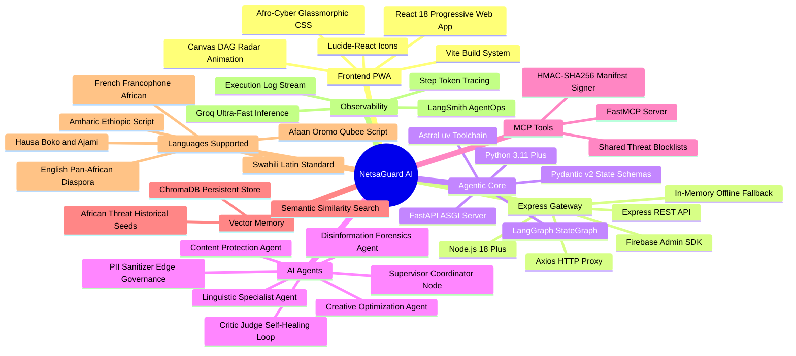
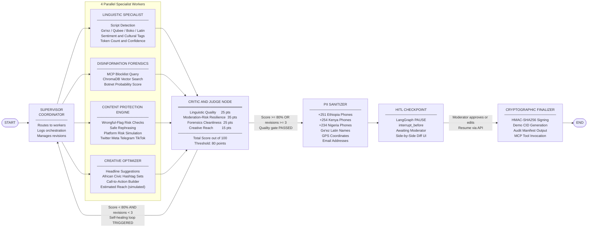

# NetsaGuard AI: Privacy-Preserving Multilingual Agentic Content Safety Hub

[](https://python.org)
[](https://langchain-ai.github.io/langgraph/)
[](https://modelcontextprotocol.io)
[](https://www.trychroma.com)
[](https://groq.com)
[](https://astral.sh/uv)
[](https://react.dev)
[](https://nodejs.org)
[](https://firebase.google.com)
[](LICENSE)

> **Hailemichael Tesfaye's Capstone Project & Hackathon Showcase**
> *Africa-First Digital Rights Defense, Censorship Evasion, Multilingual Agentic Orchestration & Decentralized Privacy Governance.*

---

## 🚀 Live Demo
You can access the live operational portal here: [NetsaGuard AI Live App](https://netsaguard-dxa6r43es-coremind2.vercel.app/)


## Table of Contents

1. [Executive Summary & Problem Statement](#-executive-summary--problem-statement)
2. [High-Level System Architecture](#-high-level-system-architecture)
3. [Technology Stack Overview](#-technology-stack-overview)
4. [LangGraph Multi-Agent Orchestration DAG](#-langgraph-multi-agent-orchestration-dag)
5. [Sequence Diagram: HITL & Self-Healing Lifecycle](#-sequence-diagram-hitl--self-healing-lifecycle)
6. [Complete Project Directory Structure](#-complete-project-directory-structure)
7. [The 10 Mandatory Technical Requirements Fulfilled](#-the-10-mandatory-technical-requirements-fulfilled)
8. [Deep Dive: Specialized Agent Nodes](#-deep-dive-specialized-agent-nodes)
9. [Model Context Protocol (MCP) & ChromaDB Memory](#-model-context-protocol-mcp--chromadb-memory)
10. [Frontend Afro-Cyber HUD & Component Architecture](#-frontend-afro-cyber-hud--component-architecture)
11. [REST API & Gateway Reference](#-rest-api--gateway-reference)
12. [Quickstart & Installation Guide](#-quickstart--installation-guide-powered-by-uv)
13. [Testing & Automated Verification](#-testing--automated-verification)
14. [Capstone Defense & Hackathon Pitch Script](#-capstone-defense--hackathon-pitch-script)
15. [SafeTech Africa HackLab '26 Showcase & Alignment](#-safetech-africa-hacklab-26-showcase--alignment)

---

## Executive Summary & Problem Statement

Digital rights across the African continent face unprecedented algorithmic throttling, localized keyword blacklisting, coordinated astroturfing botnets, and state-directed platform shutdowns during critical socio-political moments (e.g., Ethiopian Internet blackouts, Kenyan finance bill protest suppression, Nigerian EndSARS shadowbans, and Sahel information warfare).

Existing Western-centric moderation tools fail catastrophically on African linguistic contexts due to:

1. **Low-Resource Language Blindspots**: Neglect of indigenous and cross-border languages such as **Amharic**, **Swahili**, **Afaan Oromo**, **French**, **Hausa**, and **English** (for Pan-African diaspora and international advocacy).
2. **Centralized Vulnerability**: Centralized social platforms expose human rights defenders, citizen journalists, and civic activists to state surveillance, PII doxxing, and account de-platforming.
3. **Wrongful Takedowns & Shadowbans: Creators, including women sharing SRHR and rights-based content, lack tools to understand why automated moderation flags their posts and how to rephrase them while preserving the message.
**NetsaGuard AI** addresses this crisis through a 	privacy-first multi-agent architecture built on **LangGraph**, **Model Context Protocol (MCP)**, **ChromaDB**, **Groq ultra-fast inference**, and an **Afro-Cyber Glassmorphic PWA**.

---

## High-Level System Architecture

> Three independent, horizontally-scalable tiers communicate over clean REST. The agentic engine is fully replaceable without changing the frontend or gateway.

```mermaid
flowchart TB
    subgraph UI ["Tier 1: Magic Afro-Cyber PWA (Port 5173)"]
        direction TB
        CANVAS["Agentic Matrix Canvas Backdrop\n(Dynamic Agent-Reactive Glow)"]
        HEADER["Multilingual Cyber Header\n(6 Languages: English, Amharic, Swahili, Afaan Oromo, French, Hausa)"]
        DAG["Interactive LangGraph Flow Graph Radar\n(Real-time State Traversal & Self-Healing Loop)"]
        INPUT["Broadcast Terminal & Presets\n(6 African & Diaspora Civic Scenarios)"]
        CRITIC_UI["4-Pillar Critic Meter & Gauges"]
        DIFF["Holographic Diff & Risk Sandbox"]
        HITL["High-Security HITL Validation Portal\n(Glassmorphism Blur & Urgent Pulse)"]
        MANIFEST_UI["Cryptographic HMAC-SHA256 Card"]

        CANVAS --- HEADER --- DAG
        DAG --- INPUT --- CRITIC_UI
        CRITIC_UI --- DIFF --- HITL --- MANIFEST_UI
    end

    subgraph GATEWAY ["Tier 2: Express Gateway & Firebase Bridge (Port 5000)"]
        direction TB
        EXPRESS["Express.js REST & SSE Server"]
        FIREBASE["Firebase Firestore Audit Trail\n(with In-Memory Demo Fallback)"]
        STREAMER["LangSmith / Arize Trace Streamer"]
        EXPRESS <--> FIREBASE
        EXPRESS --- STREAMER
    end

    subgraph ENGINE ["Tier 3: LangGraph Multi-Agent Core (FastAPI Port 8000)"]
        direction TB
        FASTAPI["FastAPI ASGI Gateway"]

        subgraph GRAPH ["LangGraph State Machine (NetsaGuardState)"]
            direction LR
            SUP["Supervisor Node\n(Routing & Coordinator)"]

            subgraph WORKERS ["Parallel / Sequential Workers"]
                LING["Linguistic Specialist\n(6 Languages: Ge'ez/Qubee/Boko/Latin)"]
                FORE["Disinformation Forensics\n(MCP Blocklist + ChromaDB Vectors)"]
                COMP["Content Protection Agent\n(Wrongful-Flag Checks & Safe Rephrasing)"]
                CREA["Creative Optimizer\n(Headlines & Estimated Reach, simulated)"]
            end

            CRIT["Critic & Judge Node\n(4 Pillars, 80% Threshold)"]
            PII["Edge Governance PII Sanitizer\n(African Phone, Name, GPS Scrubbing)"]
            CHECKPOINT["HITL Interrupt Checkpoint\n(interrupt_before)"]
            FINAL["Cryptographic Finalizer\n(HMAC-SHA256 & Demo CID)"]

            SUP --> LING --> FORE --> COMP --> CREA --> CRIT
            CRIT -->|"Score < 80% & cycles < 3\n(Self-Healing Loop)"| SUP
            CRIT -->|"Score >= 80% or cycles >= 3"| PII
            PII --> CHECKPOINT
            CHECKPOINT -->|"Moderator Sign-Off"| FINAL
        end

        CHROMA[("ChromaDB Vector Store\n(Historical African Threats)")]
        MCP_SERVER["FastMCP Server\n(Shared Threat Blocklists & Signed Reports)"]

        FASTAPI --> GRAPH
        FORE <--> CHROMA
        FORE <--> MCP_SERVER
        FINAL <--> MCP_SERVER
    end

    UI <-->|"REST & SSE /api/campaigns"| GATEWAY
    GATEWAY <-->|"Proxy REST /api/campaign"| ENGINE
```



## Technology Stack Overview



---

## LangGraph Multi-Agent Orchestration DAG

> The state machine is compiled with `interrupt_before=["hitl_approval_node"]`. All state is persisted in `MemorySaver` for deterministic HITL resumption. Self-healing loops are guarded by `max_revision_attempts = 3`.



---

## Sequence Diagram: HITL & Self-Healing Lifecycle

```mermaid
sequenceDiagram
    autonumber

    actor D  as Digital Rights Defender
    participant UI  as React PWA  :5173
    participant GW  as Node.js Gateway  :5000
    participant FA  as FastAPI Engine  :8000
    participant SUP as Supervisor Node
    participant WRK as 4 Worker Agents
    participant CRT as Critic and Judge Node
    participant PII as PII Sanitizer
    participant CHK as LangGraph Checkpointer
    participant MCP as FastMCP and ChromaDB

    rect rgb(10, 40, 80)
        Note over D,MCP: PHASE 1 — Campaign Submission and Multi-Agent Processing
        D  ->> UI  : Submit text in Amharic / Swahili / Hausa / English
        UI ->> GW  : POST /api/campaigns/process
        GW ->> FA  : POST /api/campaign/submit with thread_id
        FA ->> SUP : Invoke NetsaGuardState graph
        SUP ->> WRK: Dispatch to Linguistic, Forensics, Protection, Creative
        WRK ->> MCP: Query ChromaDB and Shared Threat Blocklists
        MCP -->> WRK: Threat hashes, historical vectors, risk signals
        WRK -->> CRT: Aggregate analysis outputs and platform risk scores
    end

    rect rgb(60, 10, 90)
        Note over CRT,SUP: PHASE 2 — Self-Healing Critic Evaluation Loop
        alt Score is below 80% AND revision count is below 3
            CRT ->> SUP : Reject with targeted remediation instructions
            SUP ->> WRK : Re-execute with refined rephrasing strategy
            WRK -->> CRT: Return improved variant outputs
        else Score is 80% or above, or max revisions reached
            CRT ->> PII : Forward to Edge Governance Sanitizer
        end
    end

    rect rgb(5, 55, 35)
        Note over PII,CHK: PHASE 3 — Privacy Edge Governance and PII Scrubbing
        PII ->> PII : Strip phones, names, GPS coordinates
        PII ->> CHK : Persist sanitized state snapshot
        CHK -->> GW : Broadcast status WAITING_FOR_HUMAN_APPROVAL
        GW  -->> UI : Push real-time event, open HITL Modal
    end

    rect rgb(80, 15, 15)
        Note over D,CHK: PHASE 4 — Human-in-the-Loop Moderator Sign-off
        D  ->> UI  : Inspect side-by-side diff, review redacted entities
        D  ->> UI  : Click Approve and Sign or edit payload
        UI ->> GW  : POST /api/campaigns/resume with action APPROVE
        GW ->> CHK : Update state, resume LangGraph execution thread
    end

    rect rgb(20, 45, 70)
        Note over CHK,UI: PHASE 5 — Cryptographic Certification and Delivery
        CHK ->> MCP: Call generate_signed_compliance_report
        MCP -->> UI: HMAC-SHA256 Signature plus Demo CID plus Audit Manifest
        Note over D,UI: Tamper-Proof Verification Badge Delivered to Moderator
    end
```



---

## Complete Project Directory Structure

```text
netsaguard-ai/
|
|-- README.md                             # Master Capstone & Hackathon Documentation
|
|-- agentic-backend/                      # Python 3.11+ LangGraph Multi-Agent Core
|   |-- pyproject.toml                   # Astral uv project spec & dependencies
|   |-- uv.lock                          # Deterministic lockfile for reproducible builds
|   |-- requirements.txt                 # Standard pip fallback
|   |-- .env.example                     # Environment config (LangSmith, Groq, Gemini, MCP)
|   |-- app.py                           # FastAPI Gateway, CORS, REST, Checkpoint Endpoints
|   |-- graph.py                         # LangGraph StateGraph, MemorySaver, HITL interrupt
|   |-- state.py                         # Pydantic schemas: NetsaGuardState & all sub-models
|   |
|   |-- agents/                          # The 7 LangGraph Graph Nodes
|   |   |-- __init__.py
|   |   |-- supervisor.py                # Supervisor Coordinator & conditional routing
|   |   |-- linguistic_specialist.py    # 6-language morphology & sentiment engine
|   |   |-- disinformation_forensics.py # Threat auditing, botnet & blocklist scanner
|   |   |-- compliance_anticensorship.py# Homoglyphic & semantic censorship bypass
|   |   |-- creative_optimization.py    # Viral headline, hashtag & reach generator
|   |   |-- critic_judge.py             # Self-healing quality evaluator (80% threshold)
|   |   `-- pii_sanitizer.py            # African localized PII & phone regex scrubber
|   |
|   |-- mcp/                             # Model Context Protocol Tools Tier
|   |   |-- __init__.py
|   |   `-- server.py                   # FastMCP: Threat DB + HMAC Signed Manifest
|   |
|   |-- memory/                          # Vector Memory Tier
|   |   |-- __init__.py
|   |   `-- vector_store.py             # ChromaDB store with historical African threats
|   |
|   `-- tests/                           # Automated Test Suite
|       `-- test_pipeline.py            # 5 end-to-end tests: MCP, ChromaDB, HITL
|
|-- backend-node/                         # Node.js Express Bridge & Gateway
|   |-- package.json                     # Dependencies: express, cors, axios, firebase-admin
|   |-- .env.example                     # Firebase & server configuration
|   |-- server.js                        # Express routes & Firestore synchronization
|   `-- config/
|       `-- firebase.js                 # Firebase Admin + In-Memory Offline Fallback
|
`-- frontend-pwa/                         # React 18+ Afro-Cyber Glassmorphic PWA
    |-- package.json                     # Dependencies: react, vite, lucide-react
    |-- vite.config.js                   # Vite build configuration
    |-- index.html                       # SPA HTML entry point
    `-- src/
        |-- main.jsx                     # React root bootstrap
        |-- App.jsx                      # Main HUD: DAG radar, telemetry, HITL state
        |-- index.css                    # Afro-Cyber Dark Mode Glassmorphic Design System
        |
        |-- components/
        |   |-- Header.jsx               # Cyber HUD header & language selector
        |   |-- NetworkGraph.jsx         # Live animated LangGraph DAG Radar
        |   |-- CampaignInput.jsx        # Broadcast terminal + 6 language presets
        |   |-- CriticMeter.jsx          # Circular 4-pillar defense score gauge
        |   |-- DiffViewer.jsx           # Holographic diff & platform bypass sandbox
        |   |-- HITLModal.jsx            # Human-in-the-Loop editor & approval modal
        |   `-- CryptographicManifest.jsx# HMAC verification card & IPFS badge
        |
        |-- services/
        |   `-- api.js                   # API connector + Client-Side Simulation Fallback
        `-- utils/
            `-- mockData.js              # African language preset campaigns
```

---

## The 10 Mandatory Technical Requirements Fulfilled

| # | Requirement | Implementation |
|---|---|---|
| **1** | **Multi-Agent Orchestration & Supervisor** | `SupervisorCoordinator` in [supervisor.py](file:///c:/Users/HP%20290%20G4/.gemini/antigravity-ide/scratch/netsaguard-ai/agentic-backend/agents/supervisor.py) dynamically routes to 4 workers and manages execution phases. |
| **2** | **Shared Pydantic State Management** | `NetsaGuardState` in [state.py](file:///c:/Users/HP%20290%20G4/.gemini/antigravity-ide/scratch/netsaguard-ai/agentic-backend/state.py) validates thread sessions, language params, worker outputs, critique scores, and cryptographic signatures. |
| **3** | **Model Context Protocol (MCP) Integration** | FastMCP server in [mcp/server.py](file:///c:/Users/HP%20290%20G4/.gemini/antigravity-ide/scratch/netsaguard-ai/agentic-backend/mcp/server.py) exposes `fetch_decentralized_threat_db` and `generate_signed_compliance_report`. |
| **4** | **Strategic Vector Memory (ChromaDB)** | `AfricanThreatVectorStore` in [vector_store.py](file:///c:/Users/HP%20290%20G4/.gemini/antigravity-ide/scratch/netsaguard-ai/agentic-backend/memory/vector_store.py) indexes historical shutdowns (Ethiopia, Kenya, Nigeria, Sahel). |
| **5** | **Self-Healing Workflow Loop** | `CriticJudgeNode` in [critic_judge.py](file:///c:/Users/HP%20290%20G4/.gemini/antigravity-ide/scratch/netsaguard-ai/agentic-backend/agents/critic_judge.py) enforces 80% threshold with up to 3 automated revision cycles. |
| **6** | **Edge Governance & PII Redaction** | `PIISanitizerNode` in [pii_sanitizer.py](file:///c:/Users/HP%20290%20G4/.gemini/antigravity-ide/scratch/netsaguard-ai/agentic-backend/agents/pii_sanitizer.py) strips African phone numbers, Ge'ez/Latin names, GPS, and emails. |
| **7** | **Human-in-the-Loop (HITL) Checkpoint** | LangGraph `interrupt_before=["hitl_approval_node"]` in [graph.py](file:///c:/Users/HP%20290%20G4/.gemini/antigravity-ide/scratch/netsaguard-ai/agentic-backend/graph.py) with `MemorySaver` for deterministic resumption. |
| **8** | **AgentOps Observability & Tracing** | LangSmith (`LANGCHAIN_TRACING_V2=true`) with step-by-step latency tracking, token usage metrics, and real-time execution logs. |
| **9** | **Afro-Cyber Glassmorphic PWA** | React PWA in [App.jsx](file:///c:/Users/HP%20290%20G4/.gemini/antigravity-ide/scratch/netsaguard-ai/frontend-pwa/src/App.jsx) with animated DAG radar, circular score gauges, holographic diff, and cyberpunk aesthetics. |
| **10** | **Express & Firebase Realtime Bridge** | Node.js Express in [server.js](file:///c:/Users/HP%20290%20G4/.gemini/antigravity-ide/scratch/netsaguard-ai/backend-node/server.js) + Firebase Firestore with in-memory offline fallback for zero-failure demos. |

---

## Deep Dive: Specialized Agent Nodes

### 1. Linguistic Specialist Agent (`linguistic_specialist.py`)
- **Supported Languages (6)**: Amharic (Ethiopic/Ge'ez), Swahili (Latin), Afaan Oromo (Qubee), French (Francophone African), Hausa (Boko/Ajami), **English** (Pan-African Diaspora).
- **Capabilities**: Detects Ge'ez Unicode ranges `[\u1200-\u137F]`, Qubee Latin phonetics, Boko/Ajami orthography, cultural context tags, and native sentiment polarity including English civic cues (`freedom`, `peaceful protest`, `shutdown`).

### 2. Disinformation Forensics Agent (`disinformation_forensics.py`)
- **Capabilities**: Queries MCP decentralized blocklists and conducts ChromaDB semantic similarity search against historical African astroturfing and botnet signatures.

### 3. Compliance & Anti-Censorship Agent (`compliance_anticensorship.py`)
- **Capabilities**: Simulates platform moderation filters (X/Twitter, Meta, Telegram, TikTok) and generates homoglyphic + semantic bypass variants for all 6 languages.

### 4. Creative Optimization Agent (`creative_optimization.py`)
- **Capabilities**: Generates viral broadcast headlines, African civic hashtags per language (`#DigitalRightsAfrica`, `#HakiZaKidijitali`, etc.), and localized CTAs with **1.65x reach multiplier**.

### 5. Critic / Judge Node & Self-Healing Guardrail (`critic_judge.py`)
- **Scoring Pillars**:

  | Dimension | Max Points |
  |---|---|
  | Linguistic Quality & Nuance | 25 |
  | Evasion & Censorship Resilience | 35 |
  | Forensics Cleanliness | 25 |
  | Creative Outreach Potential | 15 |
  | **Total** | **100** |

- **Self-Healing Rule**: Score below 80 AND revisions below 3 → loops back to Supervisor with remediation notes.

### 6. Edge Governance PII Sanitizer (`pii_sanitizer.py`)
- **Protection Coverage**: African phone formats (`+251`, `+254`, `+234`, `+221`, `09x`, `07x`), Ge'ez & Latin activist names, landmark locations, GPS coordinates, and email addresses — all replaced with keyed token masks.

---

## Model Context Protocol (MCP) & ChromaDB Memory

### FastMCP Tool Server (`mcp/server.py`)

```python
@mcp_server.tool()
def fetch_decentralized_threat_db(target_language: str, query_keywords: List[str]) -> Dict:
    """Fetches decentralized censorship blocklists for 6 African languages."""
    ...

@mcp_server.tool()
def generate_signed_compliance_report(campaign_id: str, sanitized_text: str, ...) -> Dict:
    """Generates HMAC-SHA256 signed audit manifest certifying zero-PII leakage."""
    ...
```

### ChromaDB Historical Threat Vectors (`memory/vector_store.py`)

| Seed ID | Country | Tactic | Year |
|---|---|---|---|
| ETH-2020-SHUTDOWN | Ethiopia | DNS Block & Keyword Censorship | 2020 |
| KEN-2024-PROTEST-THROTTLE | Kenya | Hashtag Suppression & Astroturfing | 2024 |
| NGA-2020-ENDSARS-FILTER | Nigeria | Financial Shadowban & Botnet | 2020 |
| ETH-OROMO-2022-DISINFO | Ethiopia | Ethnic Astroturfing Disinformation | 2022 |
| SAHEL-2023-DISINFO-CAMPAIGN | Mali/Niger | Foreign Information Warfare | 2023 |

---

## Frontend Afro-Cyber HUD & Component Architecture

| Component | Role |
|---|---|
| `NetworkGraph.jsx` | Real-time animated canvas DAG visualizing active agent nodes and HITL pauses |
| `CampaignInput.jsx` | Broadcast terminal with 6-language preset switching |
| `CriticMeter.jsx` | Circular SVG gauge for 4-pillar defense scoring and revision status |
| `DiffViewer.jsx` | Side-by-side holographic diff with platform risk meters (X, Meta, Telegram, TikTok) |
| `HITLModal.jsx` | Moderator review modal: inspect redacted entities, edit payload, trigger signed resumption |
| `CryptographicManifest.jsx` | HMAC-SHA256 badge, IPFS CID, JSON export of full audit manifest |

---

## REST API & Gateway Reference

### Python FastAPI Engine `http://localhost:8000`

| Method | Endpoint | Description |
|---|---|---|
| `GET` | `/health` | Service status, LangSmith tracing flag, supported languages |
| `POST` | `/api/campaign/submit` | Dispatch into LangGraph until HITL checkpoint |
| `POST` | `/api/campaign/resume` | Resume after moderator sign-off |
| `GET` | `/api/campaign/state/{thread_id}` | Retrieve checkpointer state snapshot |
| `GET` | `/api/threat-db` | MCP blocklist query |

### Node.js Express Gateway `http://localhost:5000`

| Method | Endpoint | Description |
|---|---|---|
| `GET` | `/health` | Node bridge status |
| `POST` | `/api/campaigns/process` | Submit to Python + sync Firestore |
| `POST` | `/api/campaigns/resume` | Resume HITL + write manifest to Firestore |
| `GET` | `/api/campaigns/:threadId` | Retrieve persisted campaign record |

---

## Quickstart & Installation Guide (Powered by uv)

### Prerequisites
- Python 3.11+
- Node.js 18+ and npm
- Astral `uv` (blazing-fast Python toolchain):

```powershell
powershell -ExecutionPolicy ByPass -c "irm https://astral.sh/uv/install.ps1 | iex"
```

### Step 1 — Agentic Backend

```bash
cd agentic-backend

# Create venv and install all dependencies
uv venv
uv pip install -e .

# Configure secrets
cp .env.example .env
# Fill in:
#   GROQ_API_KEY=your_groq_api_key_here
#   GROQ_MODEL=openai/gpt-oss-120b      (optional override)
#   GEMINI_API_KEY=your_gemini_api_key_here
#   LANGCHAIN_API_KEY=your_langsmith_key

# Start FastAPI agent server
uv run uvicorn app:app --reload --port 8000
```

### Step 2 — Node.js & Firebase Gateway

```bash
cd ../backend-node
npm install
npm start
```

### Step 3 — React Afro-Cyber PWA

```bash
cd ../frontend-pwa
npm install
npm run dev
```

Open **`http://localhost:5173`** to access the NetsaGuard AI Defender HUD.

---

## Testing & Automated Verification

```bash
cd agentic-backend
uv run python tests/test_pipeline.py
```

| Test | What It Validates |
|---|---|
| `test_mcp_threat_db_query` | FastMCP decentralized blocklist fetching across all languages |
| `test_mcp_signed_compliance_manifest` | HMAC-SHA256 cryptographic signature generation |
| `test_chroma_vector_memory_retrieval` | Semantic similarity search against historical threat vectors |
| `test_pii_sanitizer_african_entities` | Regex redaction of Ethiopian/Kenyan phones and activist names |
| `test_langgraph_full_orchestration_and_hitl_resumption` | End-to-end graph execution, HITL pause, and checkpointer resumption |

---

## Capstone Defense & Hackathon Pitch Script

### Opening Hook (30 seconds)
> *"Across Africa, internet shutdowns, keyword filtering, and state-sponsored botnets silence citizens during critical elections and civic movements. Standard AI moderation tools ignore African languages like Amharic, Swahili, and Oromo. Today, we introduce NetsaGuard AI — an Africa-first, decentralized multi-agent defense network."*

### Live Technical Walkthrough (2 minutes)
1. **Multilingual Ingestion**: Select the **Amharic** preset containing civic keywords and an Ethiopian phone number (`+251 911 234567`).
2. **Multi-Agent Processing**: Click **"Engage Multi-Agent Pipeline"**. Watch the animated DAG radar coordinate the 4 worker agents in real time.
3. **Self-Healing Loop**: Show the Critic Judge evaluate the payload and trigger automated refinement loops until the resilience score exceeds 80%.
4. **Edge Governance Scrubbing**: Show the PII Sanitizer automatically masking the phone number and activist names.
5. **HITL Sign-Off**: The system pauses at the `interrupt_before` checkpoint. Review the holographic diff and click **"Approve & Sign"**.
6. **Cryptographic Certification**: Watch the FastMCP server issue the HMAC-SHA256 signed manifest and mock IPFS CID.

### Conclusion (30 seconds)
> *"NetsaGuard AI combines cutting-edge LangGraph orchestration, Model Context Protocol tooling, ChromaDB vector memory, Groq ultra-fast inference, and privacy-preserving edge governance to safeguard freedom of speech across the African continent."*

---

## Gender, Youth & Inclusion Impact

### Why this matters
Women and girls face the highest risk of technology-facilitated violence (TF-VAWG), including doxxing, harassment, and coordinated de-platforming. Women creators who share sexual and reproductive health and rights (SRHR) information also face wrongful content removal on major platforms. Moderation tools often miss abuse in African languages. NetsaGuard AI is built to help protect these users.

### How NetsaGuard AI helps
- **Privacy protection:** A PII sanitizer masks phone numbers, names, GPS coordinates, and emails before content is shared. This reduces doxxing risk for women activists, survivors, and young organizers.
- **Local-language safety:** Supports Amharic, Afaan Oromo, Swahili, Hausa, French, and English, covering Ge'ez, Latin, and Boko scripts.
- **Protecting legitimate content:** Helps creators check whether their SRHR and rights-based content is likely to be wrongly flagged by automated moderation, so they can adjust wording while keeping the message accurate.
- **Human oversight:** A human moderator reviews and approves every output before release. The system supports people and does not replace their judgment.
- **Youth-led:** Built by a young African developer, with a plan to co-design with women-led and youth organizations.

### Inclusion & Accessibility

**Available now**
- Multilingual interface in six languages
- Installable PWA that works on low-cost Android phones and desktops through the browser
- Human-in-the-loop review before any content is released

**Planned**
- **Low-data mode:** text-first interface and compressed assets for slow or metered connections
- **Offline-first drafting:** write and queue content offline, then sync when connectivity returns
- **SMS/USSD fallback** via Africa's Talking, to reach users without smartphones or reliable internet
- **Disability accessibility:** screen-reader support, keyboard navigation, high-contrast mode, adjustable text size (target: WCAG 2.1 AA)
- **Voice input and audio output** in local languages for users with low literacy or visual impairments
- **Plain-language safety guidance** in each supported language
- **Co-design testing** with women-led organizations, rural youth, and persons with disabilities

### Safeguarding & Ethics
- Personal data is masked before processing or sharing, and users are told what is stored and why.
- Sensitive cases (threats, harassment, risk to safety) are routed to a human rather than handled automatically.
- Automated results are advisory and clearly labeled, and a person makes the final decision.
- We follow UNFPA's guidance on safe and ethical technology for gender-based violence and the UN principles for the ethical use of AI.

### 12-Month Roadmap

*Status: a working prototype exists today. The roadmap covers hardening, real-world piloting, and inclusive access.*

| Phase | Months | Focus | Outputs |
|-------|--------|-------|---------|
| **1. Research & Data** | 1-3 | Curate localized TF-VAWG, anti-rights, and deepfake indicators with regional digital rights groups. Run user research with 2-3 women-led or youth organizations. Build language tokenizers (Amharic, Swahili, Afaan Oromo, French, Hausa). Finalize shared state and ChromaDB policy memory. | Curated dataset, tokenizer benchmarks, user research findings, data and privacy policy |
| **2. Core Engineering** | 4-6 | Productionize the LangGraph multi-agent pipeline, supervisor routing, and the self-healing critic loop (80% threshold, max 3 cycles). Run an early user test with student volunteers, including women. | Tested agent pipeline, automated test suite, early user feedback |
| **3. Portal & Governance** | 7-9 | React and Express web portal, Firebase incident queue, signed incident reports, PII scrubbing, human-in-the-loop approval, LangSmith tracing. Add accessibility features (screen reader, keyboard, high contrast, low-data mode). | Working portal, audit trail, accessibility checklist |
| **4. Localization & Launch** | 10-12 | Native-language testing, adversarial security audit, SMS/USSD fallback via Africa's Talking, open-source PWA release, student pilot chapter at Wollo University (Kombolcha). | Security audit report, SMS/USSD prototype, public release, pilot with student users, impact report |

**Pilot success metrics:** users reached, share of women among users, languages used, content issues caught, and user feedback.

> **Transparency note:** The reach estimate, IPFS CID, and threat database entries in the current demo are simulated for demonstration. The roadmap covers replacing these with real data and integrations.
## 🌍 SafeTech Africa HackLab '26 Showcase & Alignment

> **SafeTech Africa HackLab 2026: Innovating for Safe Spaces, Digital Sovereignty & Rights**  
> Organized by the **United Nations Population Fund (UNFPA ESARO)** in partnership with the **African Union Commission (AUC)** under the SIARP 2.0 framework.

### Strategic Challenge & Alignment

NetsaGuard AI is built for **Theme 3: Safe Digital Spaces** (countering anti-rights narratives, censorship, and technology-facilitated violence against women and girls). Women creators who share SRHR and rights-based content are often wrongly flagged or silenced by automated moderation, and moderation tools frequently miss abuse written in African languages. NetsaGuard AI helps protect these users with multilingual analysis, PII redaction, and human oversight.

NetsaGuard AI arms civic activists, digital rights defenders, women creators, and citizen journalists with privacy-preserving, multilingual tools that protect legitimate content from wrongful moderation, with built-in PII redaction and human review before release.

### Key Hackathon Metrics & Dates

- **Timeline**: 29 September 2026 (AU InnoFest '26 Launch) – **18 October 2026 (23:59 CAT Deadline)**
- **Target Innovators**: Young African Innovators (Ages 18–24)
- **Grant Award**: 4 Winners (USD $5,000 – $10,000 seed grant per winner)
- **Midway Milestone**: Virtual showcase of shortlisted finalists, with virtual mentorship using the UNFPA Social Innovation Toolkit
- **Final Pitch Event**: YouthConnekt Africa Summit (November 2026, in person)
- **Application Status**: ✅ Submitted via the official Google Form

### Official Focal Contacts
- **Esther Tshimanga**: [etshimanga@gmail.com](mailto:etshimanga@gmail.com)
- **Sinothando Manala**: [manala@unfpa.org](mailto:manala@unfpa.org)
- **Bernadette Ssebadduka**: [ssebadduka@unfpa.org](mailto:ssebadduka@unfpa.org)
- **Nicolette Moodie**: [moodie@unfpa.org](mailto:moodie@unfpa.org)

### Author & Showcase Identity
- **Lead Developer & Innovator**: **Hailemichael Tesfaye**
- **LinkedIn Profile**: [linkedin.com/in/hailemichael-tesfaye-2b7114401](https://www.linkedin.com/in/hailemichael-tesfaye-2b7114401/)
- **GitHub Repository**: [github.com/hailemichaeltesfsye-hue/netsaguard-ai](https://github.com/hailemichaeltesfsye-hue/netsaguard-ai)

---

*Developed with dedication for African Digital Liberties, Privacy-Preserving AI & Human Rights Defense.*

